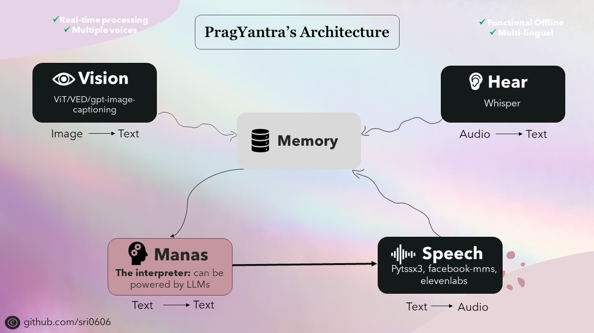

# PragYantra

PragYantra is a versatile software project that aims to simulate a humanoid robot with vision, hearing, speech, and memory functionalities. This project aims to create a flexible platform for experimenting with artificial intelligence and human-machine interaction.



## Features

- **Vision**: PragYantra simulates vision capabilities, allowing it to process visual data and make decisions based on it.
- **Hearing**: With simulated auditory sensors, PragYantra can perceive sounds and respond accordingly.
- **Speech**: PragYantra is capable of generating simulated speech output, enabling it to communicate with users in natural language.
- **Memory**: The software includes memory capabilities, enabling PragYantra to store and recall information from previous interactions.

## Technical details

One of the key design principles behind PragYantra was prioritizing offline capabilities while also integrating online functionalities. This decision was made to ensure privacy and accessibility without compromising on performance.

To achieve this, all components of the project were designed to have offline capabilities, with online functionalities available as optional features. While using offline mode may require a stronger device for faster inference, the project is fully functional and performs admirably under these conditions.

The backbone of PragYantra consists of various open-source models for tasks such as text-to-speech, speech-to-text, text-to-text, and image-to-text conversion. These models serve as the building blocks upon which PragYantra's architecture is built, with additional capabilities and concurrency seamlessly integrated to enhance overall performance and user experience.

## So...what does PragYantra mean?

PragYantra, derived from Sanskrit, is a fusion of two words: "Prag" meaning intelligent or wise, and "Yantra" referring to machine or robot. So, put together, PragYantra embodies the concept of an intelligent machine, reflecting the project's goal of creating a flexible platform for experimenting with AI and human-machine interaction.

## Setup and Installation

To set up the project, follow these steps:

1. Clone the repository:

   ```
   git clone https://github.com/sri0606/pragyantra.git
   ```

2. Navigate to the project directory:

   ```
   cd pragyantra
   ```

3. Run the setup script:

   - Run the python setup script:
     ```
     python setup.py
     ```

   OR

   - On Unix-like systems (like Linux or macOS):
     ```
     chmod +x setup.sh
     ./setup.sh
     ```
   - On Windows, using Git Bash:
     ```
     bash setup.sh
     ```

The setup script will install the necessary dependencies, download the required models, and create the necessary directories.
